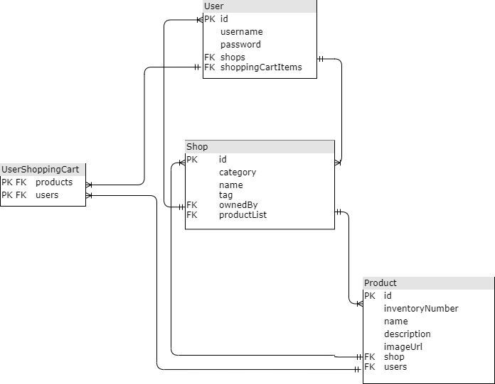
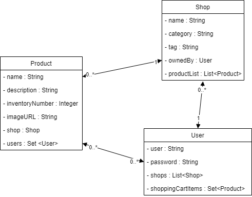

# Mini-Shopify Web App - Team Shopify2 #
Merchant can create a new shop by filling in a form containing: the name of the shop, the categories/tags relevant to the shop, and other fields that are up to you. The Merchant can upload products to populate the shop along with a description, picture, and inventory number. Customers can find a shop by looking up the name of the shop or searching by category/tag. Once they find the shop the want, they can browse through the product catalog of the shop, and can then decide to purchase one or many products by putting them in the Shopping Cart and proceeding to Checkout. The purchase itself will obviously be simulated, but purchases cannot exceed the inventory.


## Table of contents
* [Team](#team)
* [Current State](#current-state)
* [Next Sprint](#next-sprint)
* [Schema](#database-schema)
* [UML](#uml)
* [Setup](#setup)


### Status
[](https://travis-ci.com/kael558/4806Shopify)

### Team
Trevor Bivi, Ryan Gaudreault, Rahel Gunaratne, Ehren Julien-Neitzert, Aldous Rice-Leech

### Current State 
| Issue       | Member           | Progress |
| ------------- |:-------------:| -----:|
| Extra validation | Trevor | Completed
| Add shopping cart logic | Rahel | Completed
| Fix some missing references and JPA attributes | Rahel | Completed
| Make shops search more usable | Aldous | Completed
| Add Error Page | Ryan |  Completed
| Add User Page when logged in on Home page | Ryan |  Completed
| User can checkout a product | Ehren |  Completed
| Hystrix | Everyone | In Progress

### Next Sprint
| Feature       | Member           | 
| ------------- |:-------------:| 
| Hystrix  | All | 

### Database Schema
  


### UML 


### Setup
1. Clone the repository
```
$ git clone https://github.com/kael558/4806Shopify.git
```
2. Open up IntelliJ 4806Shopify
3. Run BootApplication
4. Open up local host on your favourite browser
[localhost:8080](https://localhost:8080)

### **Links**

Travis-CI: 
https://travis-ci.com/github/kael558/4806Shopify

Heroku: 
https://dashboard.heroku.com/apps/address-book-kael558/deploy/heroku-git

Deployed on Heroku at: 
https://address-book-kael558.herokuapp.com/
"# Shopify4806" 
